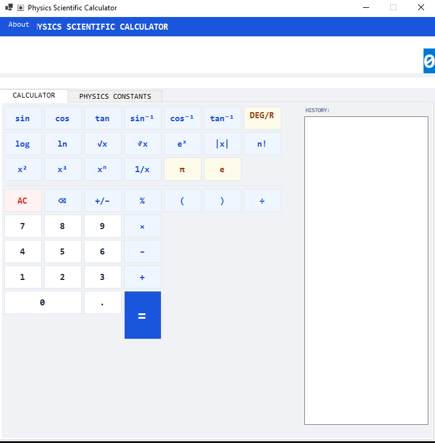

# ⚛ Physics Scientific Calculator

A scientific calculator application built with Windows Forms (.NET 10),
featuring a comprehensive physics constants library.

## Screenshot


## Features
- Full arithmetic operations (+, -, ×, ÷, %, exponentiation)
- Scientific functions: sin, cos, tan, log, ln, √, ∛, n!, |x|
- DEG / RAD angle mode
- 20 built-in physics constants (CODATA 2022)
- Add / edit / delete custom constants
- Calculation history (double-click to reuse)
- Full keyboard input support

## Tech Stack
- C# .NET 10
- Windows Forms (WinForms)

## How to Run

### Run directly via .exe
Download from the [Releases](../../releases) page

### From source code
```bash
git clone https://github.com/username/physics-scientific-calculator
cd physics-scientific-calculator
dotnet run
```

## Build
```bash
dotnet publish -c Release -r win-x64 --self-contained true -p:PublishSingleFile=true
```
